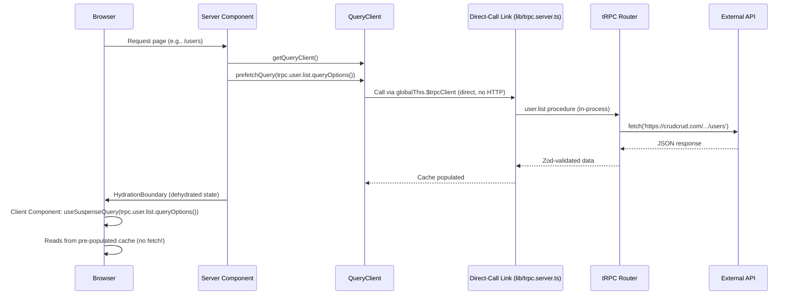
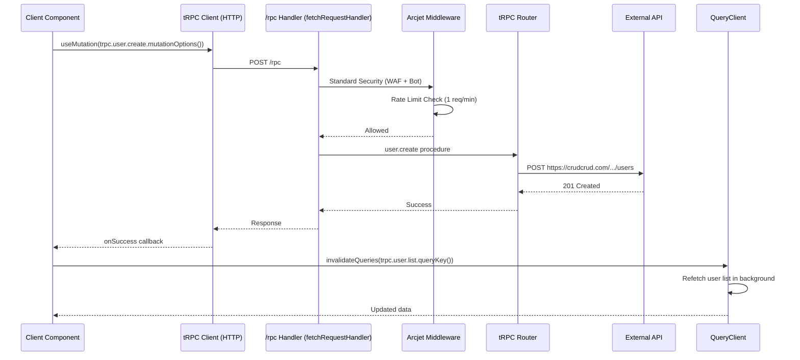
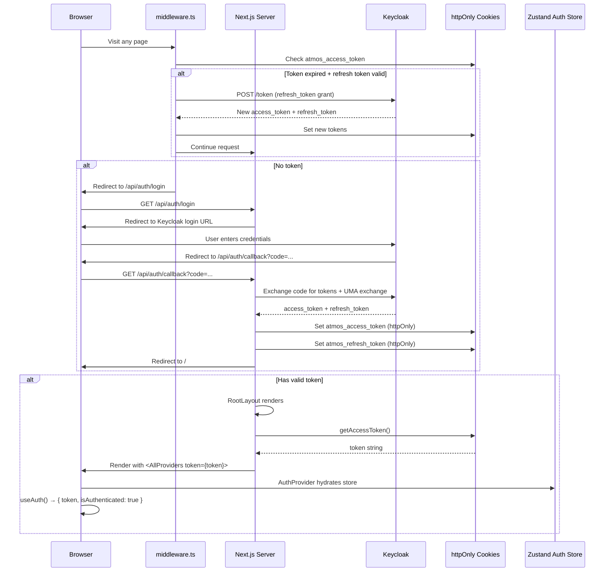
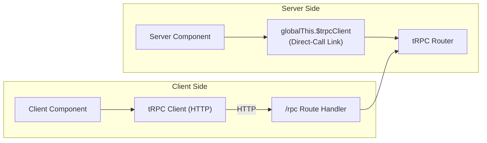
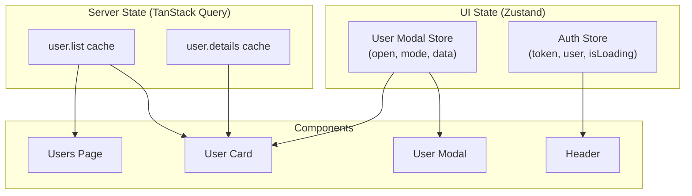
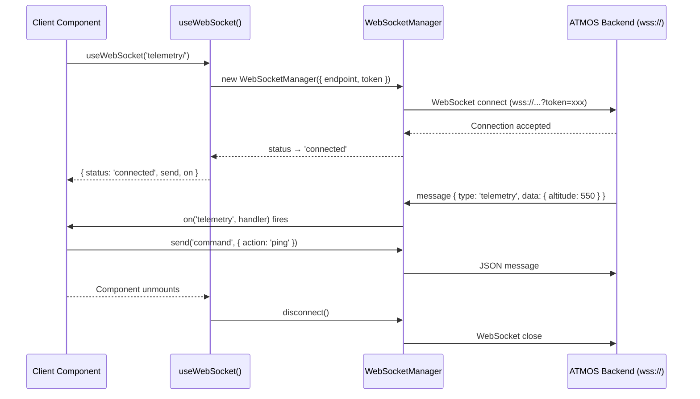

# Data Flow — Antaris

## Overview

Data in Antaris flows through a strict layered pipeline:
**UI → tRPC Client → tRPC Server (with middleware) → External API → Response → Cache → UI**

---

## 1. Read Flow (Query)

### Key Points:
- Server Component prefetches data **before** rendering
- Data is dehydrated and sent as part of the HTML
- Client component reads from cache — **zero loading state**
- After `staleTime` (60s), background refetch occurs automatically

---

## 2. Write Flow (Mutation)

### Key Points:
- Mutations go through HTTP (not direct call) — client-side tRPC client
- Security middleware runs **before** business logic
- After mutation success, related queries are invalidated
- Cache is automatically refreshed — UI stays in sync

---

## 3. Authentication Flow

### Key Points:
- Tokens stored in **httpOnly** cookies — not accessible to JavaScript
- `middleware.ts` silently refreshes expired tokens before the page renders
- Server reads cookie → passes token as prop → client Zustand hydrates
- Zero-latency auth: no `useEffect`, no loading spinner for auth state

---

## 4. tRPC Client/Server Bridge

### Dual Path:
1. **Server Components** → Use `globalThis.$trpcClient` with direct-call link (no HTTP overhead)
2. **Client Components** → Use HTTP tRPC client (httpBatchLink → `/rpc`)
3. Both paths hit the same router & procedures — consistent behavior
4. `lib/trpc.server.ts` sets up the server client; `lib/trpc.ts` picks it up via `globalThis`

---

## 5. State Management Flow

### Separation Rules:
| Data Type | Store | Example |
|---|---|---|
| API responses | TanStack Query | User list, user details |
| Auth session | Zustand (`auth-store`) | Token, user info, loading state |
| UI ephemeral state | Zustand (feature hooks) | Modal open/close, form data |
| Theme | next-themes | Dark/light mode |

---

## 6. Cache Invalidation Strategy

| Action | Invalidated Queries |
|---|---|
| Create User | `trpc.user.list.queryKey()` |
| Update User | `trpc.user.list.queryKey()`, `trpc.user.details.queryKey({ input: { userId } })` |
| Delete User | `trpc.user.list.queryKey()` |

### Cache Configuration:
- **staleTime:** 60 seconds (data considered fresh for 1 minute)
- **refetchOnWindowFocus:** true (default)
- **Hydration:** Pending queries are dehydrated for SSR

---

## 7. WebSocket Flow (Real-Time Data)

See [`docs/modules/websocket.md`](../modules/websocket.md) for the full WebSocket module documentation.
