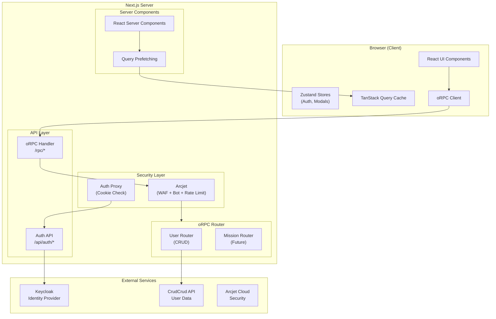

# System Design — Antaris

## High-Level Architecture



## Architecture Layers

### Layer 1: Presentation (Browser)

| Component | Technology | Purpose |
|---|---|---|
| React Components | React 19 + RSC | Render UI |
| Design System | Radix + CVA + Tailwind | Component variants |
| State (UI) | Zustand | Auth state, modal state |
| State (Server) | TanStack Query v5 | API data cache |
| Animations | Framer Motion | Motion effects |

### Layer 2: Server-Side Rendering (Next.js)

| Component | Technology | Purpose |
|---|---|---|
| Server Components | React RSC | Pre-render on server |
| Query Prefetching | TanStack HydrationBoundary | SSR → client cache transfer |
| Route Handlers | Next.js App Router | HTTP endpoint handling |

### Layer 3: API (oRPC)

| Component | Technology | Purpose |
|---|---|---|
| RPC Handler | @orpc/server/fetch | Maps HTTP → procedures |
| Router | oRPC router | Namespace-based route tree |
| Validation | Zod v4 | Input/output schema enforcement |
| Middleware | oRPC middleware | Security, context injection |

### Layer 4: Security (Arcjet)

| Component | Technology | Purpose |
|---|---|---|
| WAF | Arcjet Shield | SQL injection, XSS protection |
| Bot Detection | Arcjet detectBot | Block scrapers, allow search engines |
| Rate Limiting | Arcjet slidingWindow | 1 request/minute on mutations |

### Layer 5: Authentication (Keycloak)

| Component | Technology | Purpose |
|---|---|---|
| OAuth Flow | Keycloak OpenID Connect | User login/logout |
| UMA Exchange | Keycloak UMA 2.0 | Fine-grained authorization |
| Session | httpOnly Cookies | Secure token storage |
| Client Hydration | Zustand + AuthProvider | SSR → client token bridge |

---

## Key Design Patterns

### 1. Hybrid Hydration Pattern (Authentication)

```
Server (RootLayout)
  → getAccessToken() from cookies
  → Pass token as prop to AllProviders
  → AuthProvider immediately hydrates Zustand store
  → All client components have instant token access
```

**Why:** Zero-latency token availability. No `useEffect` waterfall. No loading state for auth.

### 2. SSR Data Prefetching (TanStack Query)

```
Server Component (page.tsx)
  → getQueryClient()
  → prefetchQuery(orpc.user.list.queryOptions())
  → dehydrate(queryClient) → HydrationBoundary
  → Client Component reads from pre-populated cache
```

**Why:** No loading flicker. Data is available on first render. SEO-friendly.

### 3. oRPC Isomorphic Client

```
Server Side: globalThis.$client = createRouterClient(router)
Client Side: client = globalThis.$client ?? createORPCClient(link)
```

**Why:** Same client interface works both on server (direct call) and client (HTTP RPC).

### 4. Middleware Chain (Security)

```
Request → base middleware (context) → arcjet/standard (WAF + bot) → arcjet/ratelimit → handler
```

**Why:** Attackers blocked before reaching business logic. Composable security layers.

### 5. Feature Module Encapsulation

```
features/<name>/
  ├── index.ts          → Public API (barrel exports)
  ├── components/       → UI components
  ├── hooks/            → State management
  └── types/            → Type definitions
```

**Why:** Domain isolation. Clear boundaries. Easy to add/remove features.

---

## Provider Tree (Nesting Order)

```
<html>
  <body>
    <ThemeProvider>           ← Dark/light mode
      <AuthProvider>          ← Zustand auth hydration
        <TanstackQueryProvider>  ← QueryClient instance
          <ModalsProvider>    ← Global modal registry
            <Toaster />      ← Toast notifications
            {children}       ← Page content
          </ModalsProvider>
        </TanstackQueryProvider>
      </AuthProvider>
    </ThemeProvider>
  </body>
</html>
```

**Order matters:** Theme must wrap Auth (for themed login), Auth must wrap Query (for authenticated API calls).

---

## Deployment Architecture

```
Browser  →  Next.js Server  →  Keycloak (SSO)
                             →  CrudCrud API (Data)
                             →  Arcjet Cloud (Security)
```

The application is designed to run as a single Next.js deployment with external dependencies for auth, data, and security.
