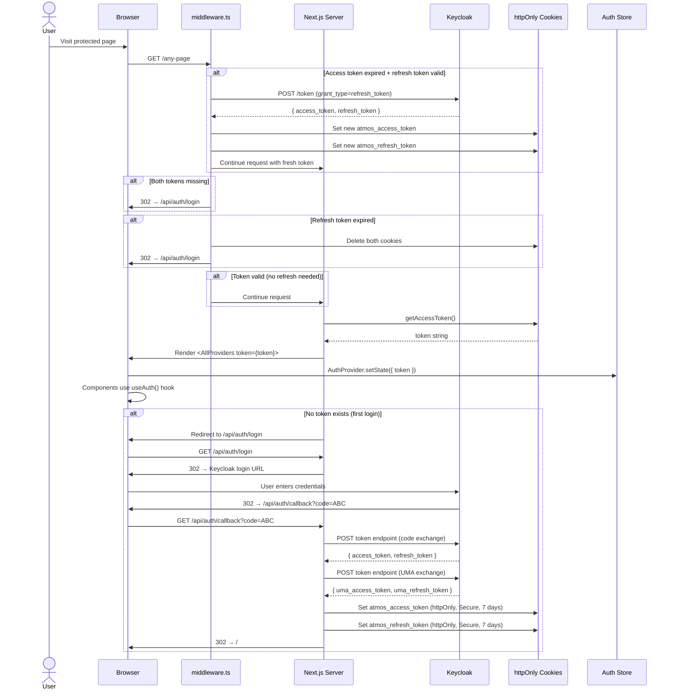

# Feature: Authentication

## Purpose
Enterprise-grade authentication system using Keycloak OAuth 2.0 with UMA (User-Managed Access) for fine-grained authorization. Implements the "Hybrid Hydration Pattern" for zero-latency token availability across all client components, and **silent token refresh** so sessions stay alive transparently.

---

## Flow



---

## Key Files

| File | Purpose |
|---|---|
| `lib/auth/keycloak.ts` | Keycloak OAuth helpers: login/logout URLs, token exchange, UMA, **token refresh** |
| `lib/auth/session.ts` | Cookie session management: get/set/clear tokens, **isTokenExpired** |
| `proxy.ts` | **Next.js proxy** (middleware entry point): silent token refresh + route protection (runs on every request) |
| `store/auth-store.ts` | Zustand store: token, user, isLoading, isError |
| `providers/auth-provider.tsx` | Bridges server-side token to Zustand store |
| `hooks/use-auth.ts` | Consumer hook: token, user, isAuthenticated |
| `app/api/auth/[...route]/route.ts` | Auth API routes: login, logout, callback |
| `providers/index.tsx` | Provider composition: places AuthProvider in tree |
| `app/layout.tsx` | Root layout: reads token, passes to providers |

---

## API Usage

### Client Components
```typescript
'use client'
import { useAuth } from '@/hooks/use-auth'

function MyComponent() {
    const { token, user, isAuthenticated, isLoading } = useAuth()
    
    if (isLoading) return <p>Loading...</p>
    if (!isAuthenticated) return <p>Please log in</p>
    
    return <p>Hello, {user.preferred_username}</p>
}
```

### Server Components
```typescript
import { getAccessToken } from '@/lib/auth/session'

async function ServerComponent() {
    const token = await getAccessToken()
    // Use token for authenticated server-side operations
}
```

### Checking Token Expiry (Server)
```typescript
import { getAccessToken, isTokenExpired } from '@/lib/auth/session'

const token = await getAccessToken()
if (token && isTokenExpired(token)) {
    // Token is expired or within 60s of expiry
}
```

---

## Silent Token Refresh

`middleware.ts` intercepts every request and handles token rotation transparently:

```
Request arrives at middleware
    ↓
Access token present + expired + refresh token present?
    │
    ├─ YES → Call Keycloak refresh endpoint
    │           ├─ Success → Set new cookies on response, continue
    │           └─ Failure → Clear cookies, redirect to login
    │
    └─ NO → Pass to proxy() for route protection
```

**Important:** After a refresh, the Zustand auth store on the client still holds the OLD token until the next full page navigation. Client-side API calls that need the current token should rely on the tRPC client (which sends requests to `/rpc` where the cookie is read server-side) — the refreshed cookie is sent automatically by the browser on every subsequent request.

> **Next.js 16+ note:** The proxy file is `proxy.ts` (not `middleware.ts`). Next.js 16 renamed the middleware convention from `middleware.ts` → `proxy.ts` and the exported function from `middleware` → `proxy`.

---

## State Handling

### Auth Store (Zustand)
```typescript
interface AuthState {
    token: string | null      // JWT access token
    user: any | null           // Decoded JWT payload
    isLoading: boolean         // Initial load state
    isError: boolean           // Auth error state
    setToken: (token) => void  // Update token
    setUser: (user) => void    // Update user info
}
```

### Hydration Process
1. `RootLayout` (Server) → calls `getAccessToken()` from cookies
2. Passes `token` to `<AllProviders token={token}>`
3. `AuthProvider` (Client) → calls `useAuthStore.setState({ token, isLoading: false })`
4. This happens **synchronously during render** — not in useEffect
5. All client components get instant access via `useAuth()`

---

## Cookie Configuration

| Cookie | Key | HttpOnly | Secure | SameSite | MaxAge |
|---|---|---|---|---|---|
| Access Token | `atmos_access_token` | ✅ | ✅ (prod) | Lax | 7 days |
| Refresh Token | `atmos_refresh_token` | ✅ | ✅ (prod) | Lax | 7 days |

> **Note:** Cookie maxAge (7 days) is the cookie TTL. The JWT `exp` inside the access token typically expires in 5–15 minutes (set by Keycloak). The middleware handles the gap by refreshing silently.

---

## Keycloak Configuration

| Parameter | Value | Env Variable |
|---|---|---|
| URL | `https://id.antaris-staging.cloud/` | `KEYCLOAK_URL` |
| Realm | `ATMOS` | `KEYCLOAK_REALM` |
| Client ID | `ATMOS-UI-CLIENT` | `KEYCLOAK_CLIENT_ID` |
| Resource Client | `ATMOS-RESOURCE-SERVER` | `KEYCLOAK_RESOURCE_CLIENT` |

---

## Edge Cases

1. **No code in callback**: Redirects to `/login?error=no_code`
2. **Token exchange fails**: Redirects to `/login?error=auth_failed`
3. **UMA exchange fails**: Same error handling as token exchange
4. **Access token expired, refresh valid**: Middleware silently refreshes — user sees no interruption
5. **Both tokens expired**: Cookies cleared, redirected to login
6. **Token decoding error in isTokenExpired**: Returns `true` (treats as expired — safe default)
7. **No KEYCLOAK_CLIENT_SECRET**: Optional, for public clients
8. **Proxy bypass**: Public routes (`/_next`, `/api/auth`, `/favicon.ico`, `/login`) skip auth check

---

## Security Notes

- **httpOnly cookies** prevent XSS token theft
- **Token exposure**: The token IS passed to JavaScript via Zustand (necessary for client-side API calls)
- **No localStorage**: Tokens are never stored in localStorage/sessionStorage
- **Middleware protection**: All non-public routes require a valid cookie — middleware runs before any page renders
- **60-second buffer**: `isTokenExpired` triggers refresh 60s before actual expiry, preventing in-flight request failures
