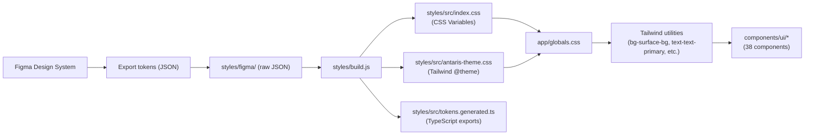

# Feature: Design System

## Purpose
A Figma-synced design system providing 38 reusable UI components, design tokens (colors, spacing, typography, radii), and a token build pipeline that transforms raw Figma exports into CSS variables and Tailwind utilities.

---

## Flow



---

## Key Files

| File | Purpose |
|---|---|
| `styles/figma/` | Raw Figma token exports (source JSON) |
| `styles/build.js` | Token build script: JSON → CSS/TS |
| `styles/src/index.css` | Generated CSS variables (`:root` block) |
| `styles/src/antaris-theme.css` | Tailwind `@theme` mapping (tokens → utilities) |
| `styles/src/tokens.generated.ts` | TypeScript token exports |
| `app/globals.css` | Global CSS: imports Tailwind + design tokens |
| `components.json` | ShadCN UI configuration (style: radix-mira) |
| `tailwind.config.ts` | Tailwind v4 configuration |
| `docs/ai-context/coding-rules.md` | Styling rules and conventions |
| `docs/ai-context/coding-rules.md` | Component creation patterns (see Section 1) |

---

## Token Categories

### Colors (Semantic)

| Category | Tokens | Usage |
|---|---|---|
| **Text** | `text-primary`, `text-secondary`, `text-disabled`, `text-selected`, `text-focus`, `text-info`, `text-warning`, `text-error` | Text content colors |
| **Icon** | `icon-primary`, `icon-secondary`, `icon-disabled`, `icon-selected`, `icon-focus`, `icon-info`, `icon-warning`, `icon-error` | Icon colors |
| **Surface** | `surface-bg`, `surface-primary`, `surface-secondary`, `surface-hover`, `surface-selected`, `surface-success`, `surface-info`, `surface-warning`, `surface-error`, `surface-overlay` | Background surfaces |
| **Stroke** | `stroke-primary`, `stroke-secondary`, `stroke-disabled`, `stroke-selected`, `stroke-success`, `stroke-info`, `stroke-warning`, `stroke-error` | Border/line colors |

### Colors (Palette)

5 color scales, each with 12 shades + 12 alpha variants:
- **Green** (green-1 → green-12, green-alpha-1 → green-alpha-12)
- **Red** (red-1 → red-12, red-alpha-1 → red-alpha-12)
- **Yellow** (yellow-1 → yellow-12, yellow-alpha-1 → yellow-alpha-12)
- **Blue** (blue-1 → blue-12, blue-alpha-1 → blue-alpha-12)
- **Gray** (gray-1 → gray-12, gray-alpha-1 → gray-alpha-12)

All colors use **OKLCH** color space for perceptual uniformity.

### Typography

| Token | Value | Usage |
|---|---|---|
| `font-heading` | Space Grotesk | Headings |
| `font-body` | Montserrat | Body text |
| `font-code` | Fira Mono | Code blocks |
| `font-weight-light` | 300 | - |
| `font-weight-regular` | 400 | - |
| `font-weight-medium` | 500 | - |
| `font-weight-bold` | 700 | - |
| `text-xxxl` → `text-xs` | 1.5rem → 0.5rem | Size scale |

### Spacing

24 spacing tokens from `0` to `100` (mapped from `dim-*` CSS variables to Tailwind `spacing-*`).

### Radii

| Token | Value |
|---|---|
| `radius-sm` | 0.125rem (2px) |
| `radius-md` | 0.25rem (4px) |
| `radius-lg` | 0.5rem (8px) |
| `radius-rounded` | 9999px |

### Effects

| Token | Value |
|---|---|
| `backdrop-blur-40` | 2.5rem |
| `backdrop-blur-60` | 3.75rem |
| `backdrop-blur-80` | 5rem |

---

## Component List (38 Components)

| Component | File | Base Library | Variant System |
|---|---|---|---|
| Accordion | `accordion.tsx` | Radix UI | - |
| Alert Dialog | `alert-dialog.tsx` | Radix UI | - |
| Animated Group | `animated-group.tsx` | Framer Motion | - |
| Avatar | `avatar.tsx` | Radix UI | CVA |
| Badge | `badge.tsx` | Custom | CVA |
| **Button** | `button.tsx` | Radix Slot | CVA (size, variant, color) |
| Card | `card.tsx` | Custom | - |
| Checkbox | `checkbox.tsx` | Radix UI | - |
| Collapsible | `collapsible.tsx` | Radix UI | - |
| Combobox | `combobox.tsx` | Custom | - |
| Drawer | `drawer.tsx` | Custom | - |
| Dialog | `dialog.tsx` | Radix UI | - |
| Dropdown Menu | `dropdown-menu.tsx` | Radix UI | - |
| Field | `field.tsx` | Custom | CVA |
| Form | `form.tsx` | react-hook-form | - |
| Frame | `frame.tsx` | Custom | - |
| Icon Button | `icon-button.tsx` | Custom | CVA |
| Input Group | `input-group.tsx` | Custom | - |
| **Input** | `input.tsx` | Custom | CVA (size, status) |
| Kbd | `kbd.tsx` | Custom | - |
| Label | `label.tsx` | Radix UI | - |
| Radio Group | `radio-group.tsx` | Radix UI | - |
| Resizable | `resizable.tsx` | react-resizable-panels | - |
| Scroll Area | `scroll-area.tsx` | Radix UI | - |
| Select | `select.tsx` | Radix UI | - |
| Separator | `separator.tsx` | Radix UI | - |
| Sheet | `sheet.tsx` | Radix Dialog | - |
| Sidebar | `sidebar.tsx` | Custom (complex) | - |
| Skeleton | `skeleton.tsx` | Custom | - |
| Sonner | `sonner.tsx` | sonner | - |
| Spinner | `spinner.tsx` | Custom | - |
| Table | `table.tsx` | Custom | - |
| Tabs | `tabs.tsx` | Radix UI | CVA |
| Text Effect | `text-effect.tsx` | Framer Motion | - |
| **Text** | `text.tsx` | Custom | CVA (size, weight, color) |
| Textarea | `textarea.tsx` | Custom | CVA |
| Toaster | `toaster.tsx` | sonner | - |
| Tooltip | `tooltip.tsx` | Radix UI | - |

---

## Build Pipeline

### Token Build (`npm run build:token`)
```bash
node styles/build.js
```
Reads Figma JSON exports → generates `index.css`, `antaris-theme.css`, `tokens.generated.ts`

### Icon Build (`npm run build:icon`)
```bash
node icons/build.js
```
Reads SVG files from `icons/svg/` → generates React components in `icons/src/`

---

## Edge Cases & Known Issues

### 1. Dark Mode Only
Only dark mode tokens are currently defined in `styles/src/index.css`. The `:root` block contains only the dark palette.

**Light mode status:** Not planned for the current demo phase. If needed, add a `.light` class block to `index.css` and override the semantic tokens (`text-primary`, `surface-bg`, etc.) with light equivalents. The `ThemeProvider` already supports the `class` strategy via `next-themes`.

---

### 2. Token Name Typos (Inherited from Figma)

These typos exist in the generated CSS and TypeScript tokens. They are inherited from the Figma source file and carried through the build pipeline as-is:

| Typo token | Correct name | Impact |
|---|---|---|
| `surface-warnig` | `surface-warning` | Warning surface backgrounds may not resolve correctly |
| `icon-focus-subltle` | `icon-focus-subtle` | Focus icon color may not apply |

**Why not fixed:** Changing the token names would require updating the Figma source and re-syncing. Any component that already uses the typo'd name would break silently if renamed without a codebase-wide find-and-replace.

**How to use:** If you need `surface-warning`, check whether `surface-warnig` (typo) is the token that actually exists in `index.css`. Use the typo'd name in your className to match the generated CSS variable.

**Fix plan:** When Figma tokens are next re-exported, fix the names in the Figma file before running `pnpm build:token`.

---

### 3. Separator Gradient
`stroke-separator` is a `linear-gradient`, not a solid color. It cannot be used as `border-color`. Instead use:

```typescript
// ✅ Correct
className="bg-(image:--color-stroke-separator)"

// or via background-image utility if mapped in @theme
className="bg-image-stroke-separator"
```
