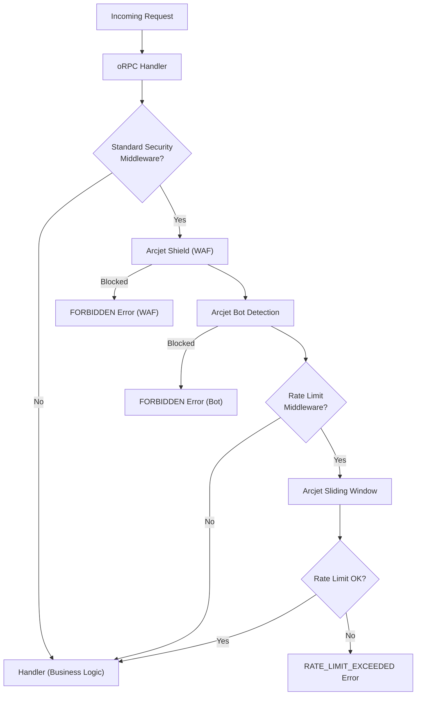

# Feature: Security (Arcjet)

## Purpose
Application-level security using Arcjet — a programmable firewall that protects oRPC API endpoints from bots, abuse, SQL injection, XSS, and excessive request rates. Security runs as oRPC middleware **before** any business logic executes.

---

## Flow



---

## Key Files

| File | Purpose |
|---|---|
| `lib/arcjet.ts` | Arcjet client initialization and rule re-exports |
| `app/(server)/middlewares/arcjet/standard.ts` | WAF (Shield) + Bot Detection middleware |
| `app/(server)/middlewares/arcjet/ratelimit.ts` | Sliding Window rate limiter middleware |
| `app/(server)/middlewares/base.ts` | Base middleware with error type definitions |

---

## Security Rules

### Shield (WAF)
- **Mode:** LIVE (blocks in production)
- **Protects against:** SQL injection, XSS, path traversal, common exploits
- **Applied to:** Create, Update, Delete operations

### Bot Detection
- **Mode:** LIVE (blocks in production)
- **Allows:** Search engines (Google, Bing), monitors (uptime), previews (Slack, Discord)
- **Blocks:** Unknown bots, AI scrapers, scraping tools
- **Applied to:** Create, Update, Delete operations

### Rate Limiting
- **Algorithm:** Sliding Window
- **Limit:** 1 request per minute per user
- **Mode:** LIVE
- **Applied to:** Create, Update operations

---

## Middleware Applied to Routes

| Route | Standard Security | Rate Limit |
|---|---|---|
| `user.list` (GET) | ❌ | ❌ |
| `user.details` (GET) | ❌ | ❌ |
| `user.create` (POST) | ✅ | ✅ |
| `user.update` (PUT) | ✅ | ✅ |
| `user.delete` (DELETE) | ✅ | ❌ |

---

## Configuration

```typescript
// lib/arcjet.ts
export default arcjet({
    key: process.env.ARCJET_KEY!,
    characteristics: ["userId"],
    rules: [] // Rules applied per-middleware, not globally
})
```

| Env Variable | Purpose |
|---|---|
| `ARCJET_KEY` | Arcjet API key (from app.arcjet.com) |

---

## Edge Cases

1. **Arcjet service down:** Requests are blocked (fail-closed design — security > availability)
2. **Missing ARCJET_KEY:** Arcjet initialization will throw at startup
3. **Hardcoded userId:** Currently uses a static userId (`"use676fuyg9r123764897hj87tig"`) — should be replaced with actual user ID from auth token in production
4. **DRY_RUN mode:** Available for testing — logs decisions without blocking
