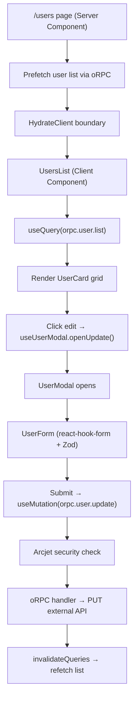

# Feature: User Management

## Purpose
Full CRUD (Create, Read, Update, Delete) application for managing system users. Demonstrates the production-grade data flow pattern used across the Antaris ATMOS platform.

---

## Flow



---

## Key Files

| File | Purpose |
|---|---|
| `app/users/page.tsx` | Server Component — prefetches data, hydrates client |
| `app/users/layout.tsx` | Users layout with BackgroundProvider |
| `app/users/[userId]/` | User detail page (dynamic route) |
| `features/users/index.ts` | Barrel exports |
| `features/users/components/users-list.tsx` | Client Component — renders user grid with useQuery |
| `features/users/components/user-card.tsx` | Individual user card with edit/delete actions |
| `features/users/components/user-form.tsx` | Form with react-hook-form + Zod validation |
| `features/users/components/user-modal.tsx` | Dialog modal for create/update |
| `features/users/components/create-user-button.tsx` | Button that triggers create modal |
| `features/users/hooks/useUserModal.ts` | Zustand store for modal state |
| `features/users/types/user-schema.ts` | Zod schema for user form validation |
| `app/(server)/router/user.ts` | oRPC route definitions (server-side) |

---

## API Usage

### Read (Server-side prefetch)
```typescript
// app/users/page.tsx
const queryClient = getQueryClient()
await queryClient.prefetchQuery(orpc.user.list.queryOptions())
```

### Read (Client-side)
```typescript
// features/users/components/users-list.tsx
const { data } = useQuery(orpc.user.list.queryOptions())
```

### Create
```typescript
useMutation({
    ...orpc.user.create.mutationOptions(),
    onSuccess: () => queryClient.invalidateQueries({ queryKey: orpc.user.list.queryKey() })
})
```

### Update
```typescript
useMutation({
    ...orpc.user.update.mutationOptions(),
    onSuccess: () => {
        queryClient.invalidateQueries({ queryKey: orpc.user.list.queryKey() })
        queryClient.invalidateQueries({ queryKey: orpc.user.details.queryKey({ input: { userId } }) })
    }
})
```

### Delete
```typescript
useMutation({
    ...orpc.user.delete.mutationOptions(),
    onSuccess: () => queryClient.invalidateQueries({ queryKey: orpc.user.list.queryKey() })
})
```

---

## State Handling

### Server State (TanStack Query)
- User list: cached with key `orpc.user.list.queryKey()`  
- User details: cached with key `orpc.user.details.queryKey({ input: { userId } })`
- staleTime: 60 seconds

### UI State (Zustand — `useUserModal`)
| Property | Type | Purpose |
|---|---|---|
| `open` | boolean | Modal visibility |
| `mode` | "create" \| "update" | Current operation mode |
| `data` | UserType | Form data (pre-populated for edit) |
| `userId` | string \| undefined | Target user ID (for update/delete) |
| `openCreate()` | function | Opens modal in create mode |
| `openUpdate(data)` | function | Opens modal in edit mode with data |
| `close()` | function | Closes modal |
| `updateData(partial)` | function | Updates form data |
| `validate()` | function | Runs Zod validation on current data |

---

## Validation (Zod Schema)

```typescript
userFormSchema = z.object({
    name: z.string().min(3).max(50),
    username: z.string().min(3).max(20).regex(/^[a-zA-Z0-9_]+$/),
    email: z.email(),
    gender: z.string().min(4),
    address: z.object({
        street: z.string().min(2),
        city: z.string().min(2),
        suite: z.string().min(2),
        zipcode: z.string().regex(/^\d{5,6}$/),
        geo: z.object({
            lat: z.string().regex(/^[-+]?\d+(\.\d+)?$/),
            lng: z.string().regex(/^[-+]?\d+(\.\d+)?$/),
        }),
    }),
    phone: z.string().regex(/^[0-9+\-\s()]{7,20}$/),
    website: z.string(),
    company: z.object({
        name: z.string().min(2),
        catchPhrase: z.string().min(2),
        bs: z.string().min(2),
    }),
})
```

---

## Edge Cases

1. **Empty user list**: Returns `{ success: true, data: [] }` — UI should show empty state
2. **API failure**: Returns `{ success: false, data: [] }` — shows Error component
3. **Rate limited**: Create/Update blocked after 1 request/min — shows rate limit error toast
4. **Bot detection**: Automated requests blocked by Arcjet — returns FORBIDDEN error
5. **Avatar generation**: Avatars are auto-generated via DiceBear API using username/email as seed
6. **Concurrent edits**: No optimistic locking — last write wins
7. **Form pre-population**: Suite and company fields are auto-generated with random values on create
