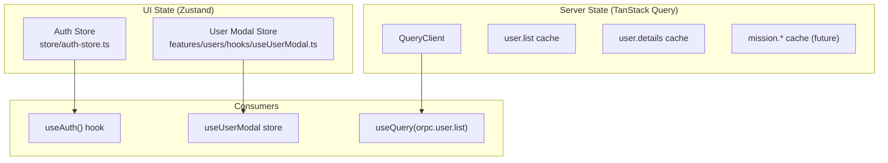

# Module: State Management

## Purpose
State management in Antaris uses a **dual-store pattern**: Zustand for UI/client state and TanStack Query for server/API state. This separation ensures clean data flow and prevents common anti-patterns.

---

## Architecture



---

## Zustand Stores

### Auth Store (`store/auth-store.ts`)
Global authentication state, hydrated from server-side cookie.

| State | Type | Purpose |
|---|---|---|
| `token` | `string \| null` | JWT access token |
| `user` | `any \| null` | Decoded user info |
| `isLoading` | `boolean` | Initial hydration state |
| `isError` | `boolean` | Auth error flag |

**Consumer:** `hooks/use-auth.ts` → `useAuth()` hook

### User Modal Store (`features/users/hooks/useUserModal.ts`)
Feature-local store for create/update modal state.

| State | Type | Purpose |
|---|---|---|
| `open` | `boolean` | Modal visibility |
| `mode` | `"create" \| "update"` | Operation mode |
| `data` | `UserType` | Form data |
| `userId` | `string \| undefined` | Target user ID |

**Consumer:** Direct import from `features/users`

---

## TanStack Query Configuration

### QueryClient Factory (`lib/query/client.ts`)
```typescript
new QueryClient({
    defaultOptions: {
        queries: {
            staleTime: 60 * 1000,  // 60 seconds
            queryKeyHashFn: custom oRPC serializer
        },
        dehydrate: { shouldDehydrateQuery, serializeData },
        hydrate: { deserializeData }
    }
})
```

### SSR Hydration (`lib/query/hydration.tsx`)
- `getQueryClient()` — cached per-request QueryClient (React `cache()`)
- `HydrateClient` — wraps children in `HydrationBoundary`

---

## Rules

| Rule | Rationale |
|---|---|
| API data → TanStack Query only | Automatic caching, refetching, invalidation |
| Auth state → Zustand only | Synchronous access, SSR hydration |
| Modal/UI state → Zustand (feature-local) | Simple, no over-engineering |
| Never store API data in Zustand | Prevents stale data, duplicate state |
| Never use TanStack Query for UI state | Wrong tool for the job |
